<div align="center">
# 🎙️ Meeting RAG

### *AI-Powered Meeting Assistant with Real-Time Transcription & Intelligent Document Search*

[](https://choosealicense.com/licenses/mit/)
[](https://nextjs.org/)
[](https://fastapi.tiangolo.com/)
[](https://www.postgresql.org/)
[](https://www.pinecone.io/)
[](https://deepgram.com/)
[](https://meet-rag.vercel.app)

[🚀 Live Demo](https://meet-rag.vercel.app) • [🎥 Watch Demo](#-demo--screenshots) • [📖 Documentation](#-documentation) • [⚡ Quick Start](#-quick-start)

---

**Multimodal RAG system that transforms meetings into searchable, intelligent conversations**

---

## 🌟 What is Meeting RAG?

Meeting RAG revolutionizes how you handle meetings by combining **real-time transcription**, **document intelligence**, and **AI-powered search** into one seamless experience.

### 💡 The Problem

- 📝 Important meeting details get lost in conversations
- 🔍 Finding specific information across documents is time-consuming
- 🤔 Context from uploaded materials isn't readily available during meetings
- ⏰ Manual note-taking distracts from active participation

### ✨ The Solution

Meeting RAG provides an **AI assistant that listens, understands, and retrieves** relevant information from your documents and the web in real-time while you focus on the conversation.

---

## 🎯 Key Features

| Feature | Description |
|---------|-------------|
| 🎙️ **Real-Time Transcription** | Deepgram Nova-2 powered dual-channel live transcription |
| 📄 **Multimodal Document Processing** | Extract text, images, and perform OCR on PDFs |
| 🖼️ **Image Understanding** | Caption images using Mistral Pixtral-12B vision model |
| 🔍 **Intelligent Search** | Semantic search across documents + web with Serper API |
| 🤖 **AI Agents** | Autonomous question answering during meetings |
| 💬 **Interactive Q&A** | Type questions and get instant AI-powered responses |
| 🔐 **Email Authentication** | Secure access with email-based auth |
| ☁️ **Cloud Storage** | Cloudinary integration for image and document storage |
| 📊 **Detailed Results** | View web search, document matches, and LLM responses separately |

---

## 🏗️ Architecture

### 📥 Document Processing Pipeline

```mermaid
graph TD
    %% === Pipeline 1: PyMuPDF Text + Image Extraction ===
    subgraph Pipeline1["🧩 Pipeline 1: PyMuPDF Extraction"]
        A1["📄 PDF Upload"] --> B1["🧠 Extract Text & Images (PyMuPDF)"]
        B1 --> C1["🖼️ Upload Images to Cloudinary"]
        C1 --> D1["🎨 Generate Captions (Pixtral-12B)"]
        B1 --> E1["✂️ Chunk Extracted Text"]
        D1 --> F1["🧬 Generate Embeddings (Captions)"]
        E1 --> G1["🧬 Generate Embeddings (Text)"]
        F1 --> H1["📊 Store in Vector DB (Pinecone)\nwith Image URLs & Captions"]
        G1 --> H1
    end

    %% === Pipeline 2: Page-wise OCR Extraction ===
    subgraph Pipeline2["🔁 Pipeline 2: Page-wise OCR Extraction"]
        A2["📄 PDF Upload"] --> B2["🖼️ Convert Each Page → PNG"]
        B2 --> C2["☁️ Upload PNGs to Cloudinary"]
        C2 --> D2["🧾 OCR Each Page (Text Recognition)"]
        D2 --> E2["🧬 Generate Embeddings (OCR Text)"]
        E2 --> F2["📊 Store in Vector DB (Pinecone)\nwith Page Image URLs & OCR Data"]
    end
```


### 🔄 Dual Processing Approach

#### **Pipeline 1: Text + Vision Processing**
```
PDF Upload → Extract Images & Text → Store Images on Cloudinary
    ↓                                            ↓
Chunk Text                              Caption with Pixtral-12B
    ↓                                            ↓
    └──────────→ Generate Embeddings ←──────────┘
                        ↓
                Store in Pinecone
```

#### **Pipeline 2: OCR Processing**
```
PDF Upload → Process Each Page → OCR with OCR.space API
                                        ↓
                            Store on Cloudinary
                                        ↓
                            Generate Embeddings
                                        ↓
                            Store in Pinecone
```

### 🎙️ Real-Time Meeting Pipeline
```
┌─────────────────┐      ┌──────────────────┐      ┌─────────────────┐
│  Audio Stream   │ ───> │  WebSocket       │ ───> │  Deepgram       │
│  (User Mic)     │      │  Connection      │      │  Nova-2 API     │
└─────────────────┘      └──────────────────┘      └─────────────────┘
                                                            ↓
┌─────────────────┐      ┌──────────────────┐      ┌─────────────────┐
│  UI Display     │ <─── │  WebSocket       │ <─── │  Transcription  │
│  (Live Text)    │      │  Response        │      │  (Interim/Final)│
└─────────────────┘      └──────────────────┘      └─────────────────┘
```

### 🔍 Intelligent Query Processing
```
User Question/Agent Query
        ↓
Query Enhancement (LLM)
        ↓
    ┌───┴───┐---
    ↓       ↓
Web Search  Vector Search
(Serper)    (Pinecone)
    ↓       ↓
    └───┬───┘
        ↓
Context Aggregation
        ↓
Gemini 2.5 Pro Processing
        ↓
Formatted Response
(Web Results | Doc Matches | AI Answer)
```

---

## 🎥 Demo & Screenshots

### 📹 Full Feature Walkthrough

[](https://drive.google.com/file/d/1IblvVpcRTP1AnlcegqEMBot-M8xjodJC/view)

*6-minute comprehensive demonstration of all features*

### 📸 Application Screenshots

#### 🏠 Main Dashboard


#### 🎙️ Live Meeting Interface


### 🎯 Transcription Quality Comparison

[](https://drive.google.com/file/d/1AZ968oFkcl-NMvPrVn6HWxIxY8T0pFRE/view)

*Side-by-side comparison with AssemblyAI Playground - matching accuracy!*


---


## 🛠️ Tech Stack

### 🎨 Frontend

| Technology | Purpose |
|-----------|---------|
| **Next.js 14** | React framework with App Router |
| **TypeScript** | Type-safe development |
| **Tailwind CSS** | Utility-first styling |
| **Prisma** | Type-safe database ORM |
| **NextAuth.js** | Authentication |
| **WebSocket** | Real-time communication |
| **Redis** | Session & cache management |

### ⚡ Backend

| Technology | Purpose |
|-----------|---------|
| **FastAPI** | High-performance Python API |
| **PostgreSQL** | Relational database |
| **Prisma** | Database ORM |
| **Redis** | Caching |
| **WebSocket** | Bidirectional communication |

### 🤖 AI & ML Services

| Service | Model/API | Purpose |
|---------|-----------|---------|
| **Deepgram** | Nova-2 | Real-time speech-to-text |
| **Mistral AI** | Pixtral-12B | Vision model for image captioning |
| **Google AI** | Gemini 2.5 Pro | Text generation & reasoning |
| **Google AI** | gemini-embedding-001 | Text embeddings |
| **OCR.space** | OCR API | Optical character recognition |
| **Serper** | Search API | Web search integration |
| **Pinecone** | Vector DB | Semantic search |
| **Cloudinary** | Storage | Image & document hosting |

---

## 🎯 How It Works

### 📄 Document Upload Flow

1. **User uploads PDF/images** → Frontend validates and sends to backend
2. **Backend extracts content** → Separate text and images
3. **Image processing** → Upload to Cloudinary → Caption with Pixtral-12B
4. **Text processing** → Chunk into semantic segments
5. **OCR processing** → Each PDF page → OCR.space → Extract text
6. **Embedding generation** → Gemini embedding model
7. **Store vectors** → Pinecone with metadata (page numbers, image URLs, captions)

### 🎙️ Real-Time Meeting Flow

1. **User joins meeting** → WebSocket connection established
2. **Audio streaming** → Browser Display → WebSocket → Backend
3. **Backend forwards** → Deepgram Nova-2 dual channel via WebSocket
4. **Transcription** → Deepgram returns interim & final transcripts
5. **Backend broadcasts** → All connected clients receive live transcription
6. **Display** → React components update in real-time

### 🔍 Query Processing Flow

1. **User asks question** (typed or via agent)
2. **Query enhancement** → LLM improves query for better retrieval
3. **Parallel search**:
   - 🌐 **Web search** via Serper API
   - 📄 **Document search** via Pinecone vector similarity
4. **Context aggregation** → Combine web results + document chunks
5. **LLM processing** → Gemini 2.5 Pro generates answer with context
6. **Formatted response** → User sees:
   - 🌐 Web search results (with links)
   - 📄 Document matches (with page numbers & images)
   - 🤖 AI-generated answer

---

## 🌟 Cool Features

### ⚡ Real-Time Transcription Excellence

#### 🎯 **Accuracy**
- Matches AssemblyAI playground quality
- Dual-channel support (stereo audio)
- Interim + final transcripts
- Low latency (<500ms)

#### 🔧 **Technical Features**
- WebSocket-based streaming
- Automatic reconnection
- Buffer management
- Error recovery

### 🖼️ Multimodal Understanding

- 📷 **Vision AI** extracts meaning from images in documents
- 📝 **OCR** handles scanned documents and handwriting
- 🔗 **Context linking** connects images to related text
- 🎨 **Visual search** find documents by image content

### 🤖 Intelligent Agents
```python
# Agent autonomously generates questions based on context
agent_questions = [
    "What are the key decisions from this meeting?",
    "Are there any action items mentioned?",
    "What documents were referenced?"
]

```

---


## 🎓 Use Cases

### 👔 Business Meetings

- 📝 Automatic meeting minutes generation
- 🔍 Quick reference to previous discussions
- 📊 Action item tracking
- 🤝 Client presentation assistance

### 🎓 Educational Sessions

- 📚 Lecture transcription & notes
- 🔍 Search through course materials
- 📖 Reference textbooks during discussions
- 👨‍🏫 Q&A assistance

### 💼 Sales & Consulting

- 📄 Proposal document reference
- 🎯 Client requirement tracking
- 💡 Instant data retrieval
- 📈 Performance metrics discussion

### 🏥 Healthcare (Compliance Dependent)

- 📋 Patient information reference
- 📊 Research paper consultation
- 🔍 Medical terminology assistance
- 📝 Session documentation

---


## Author

### **shsax**

🎓 B.Tech in Information Technology

[](https://linkedin.com/in/shsax)
[](https://shsax.vercel.app)


</div>

